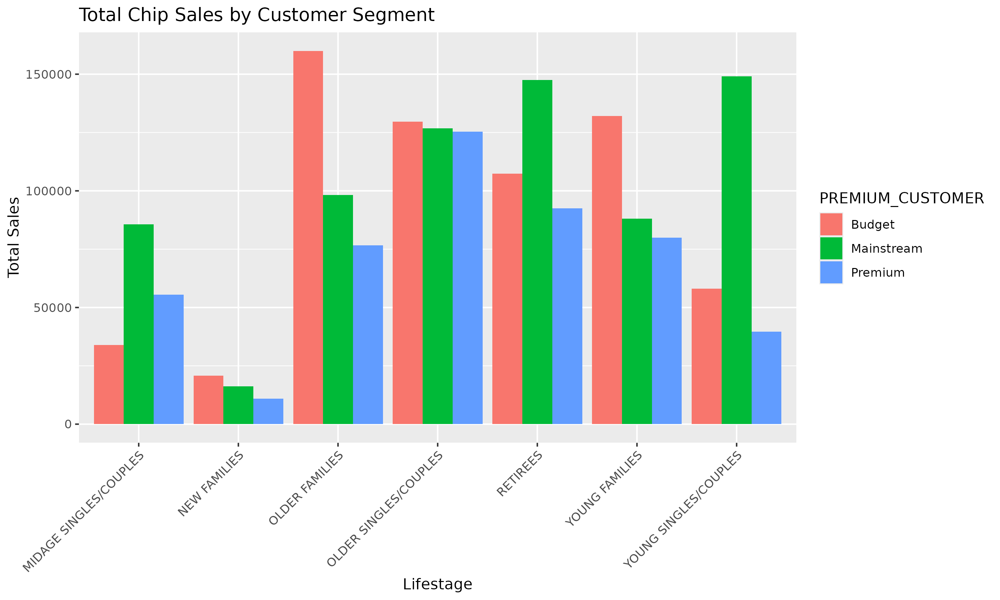
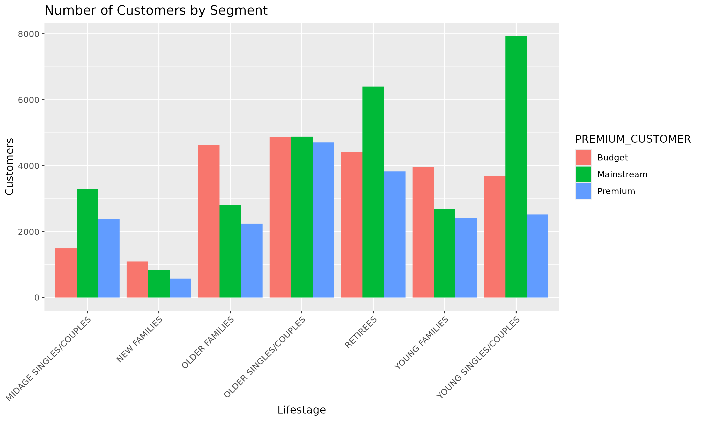
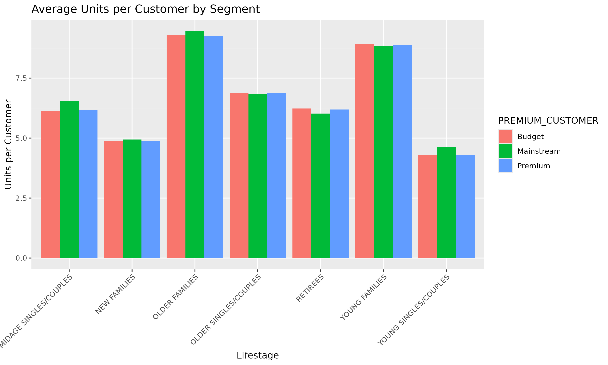
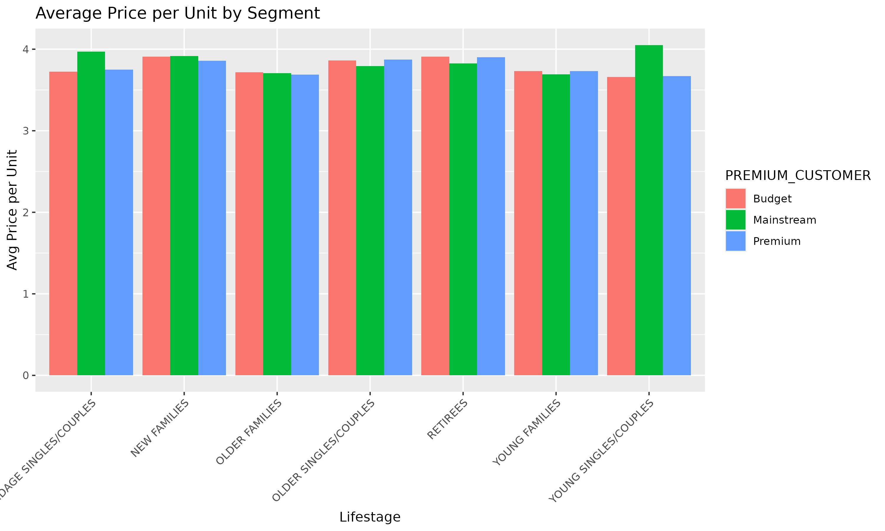
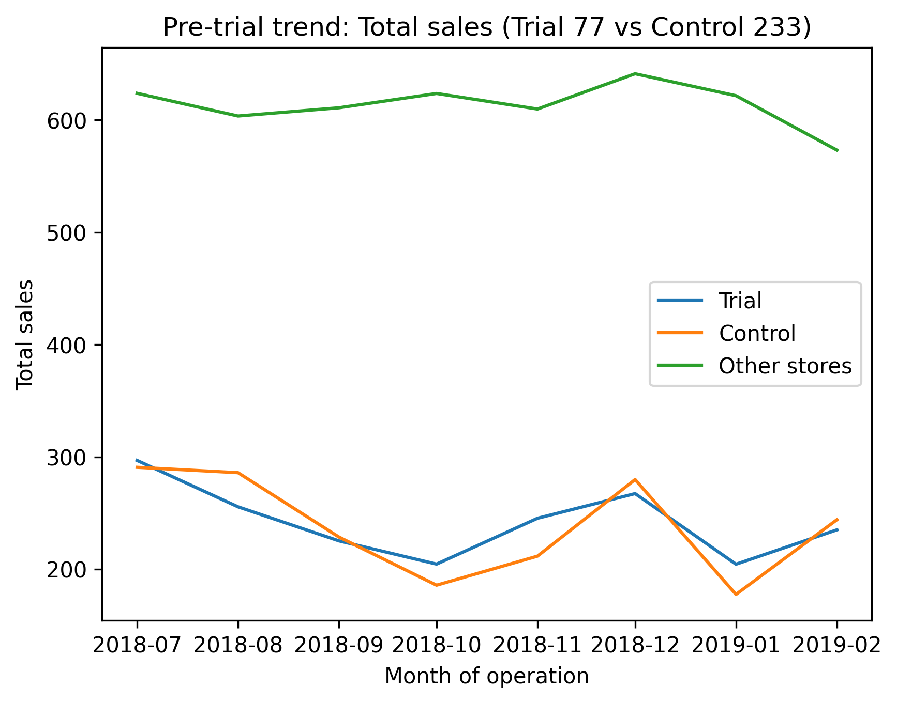
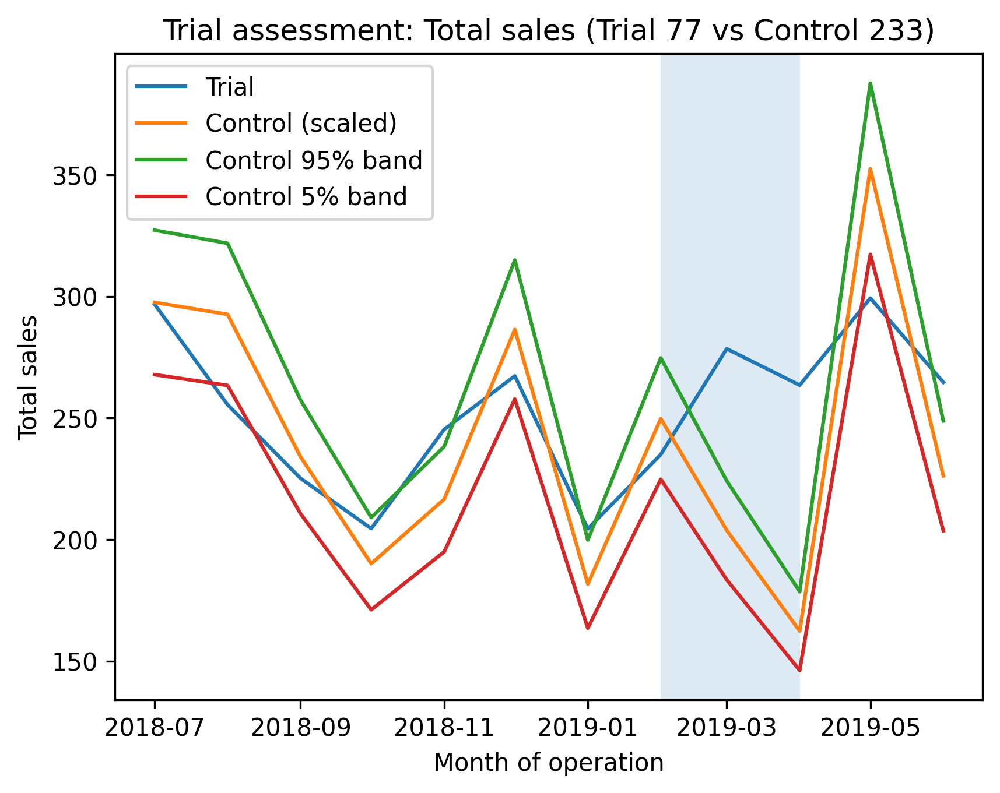
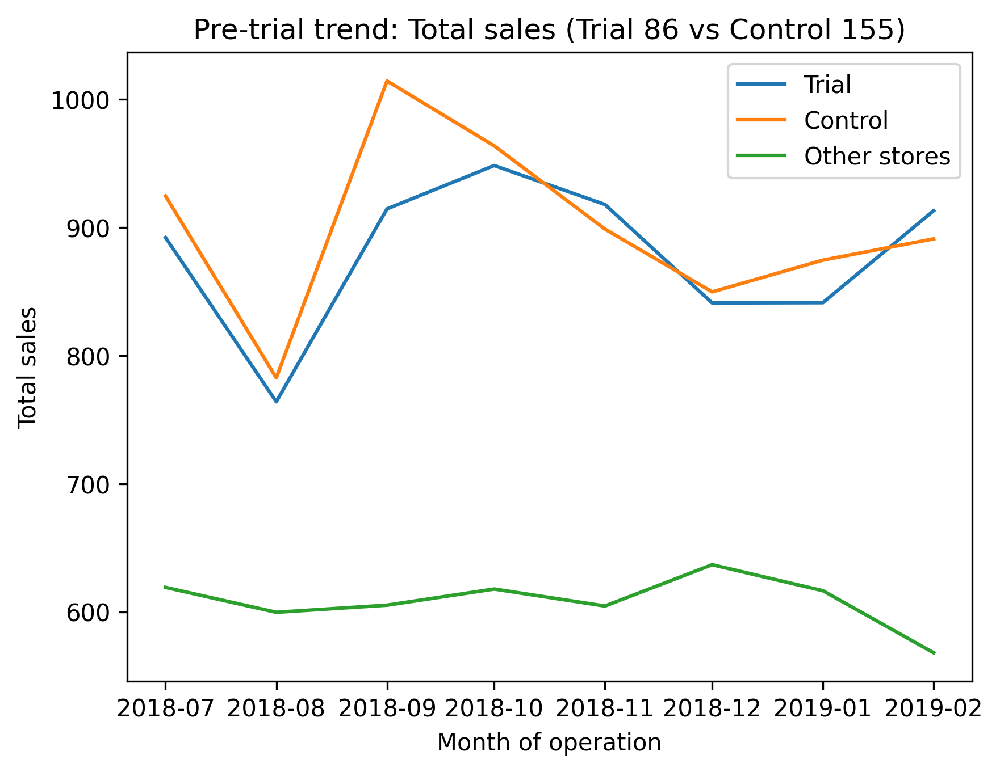
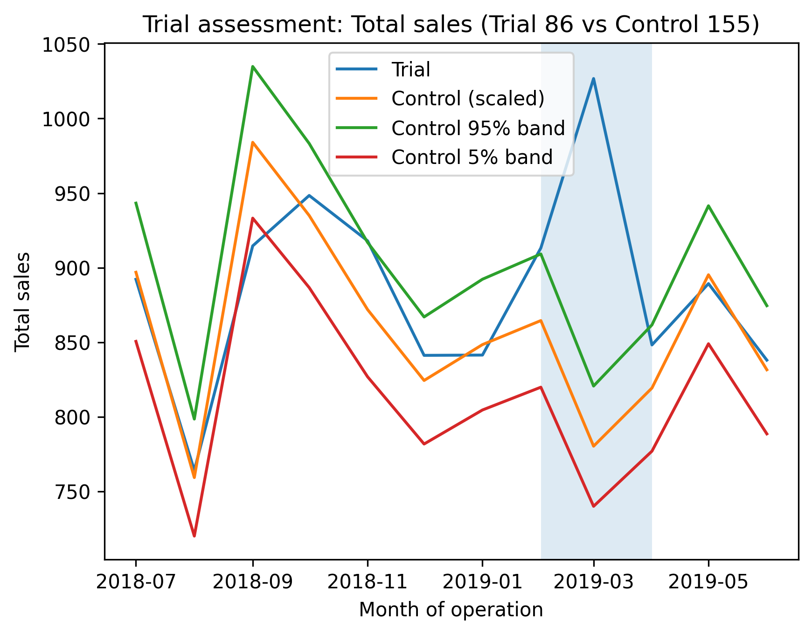
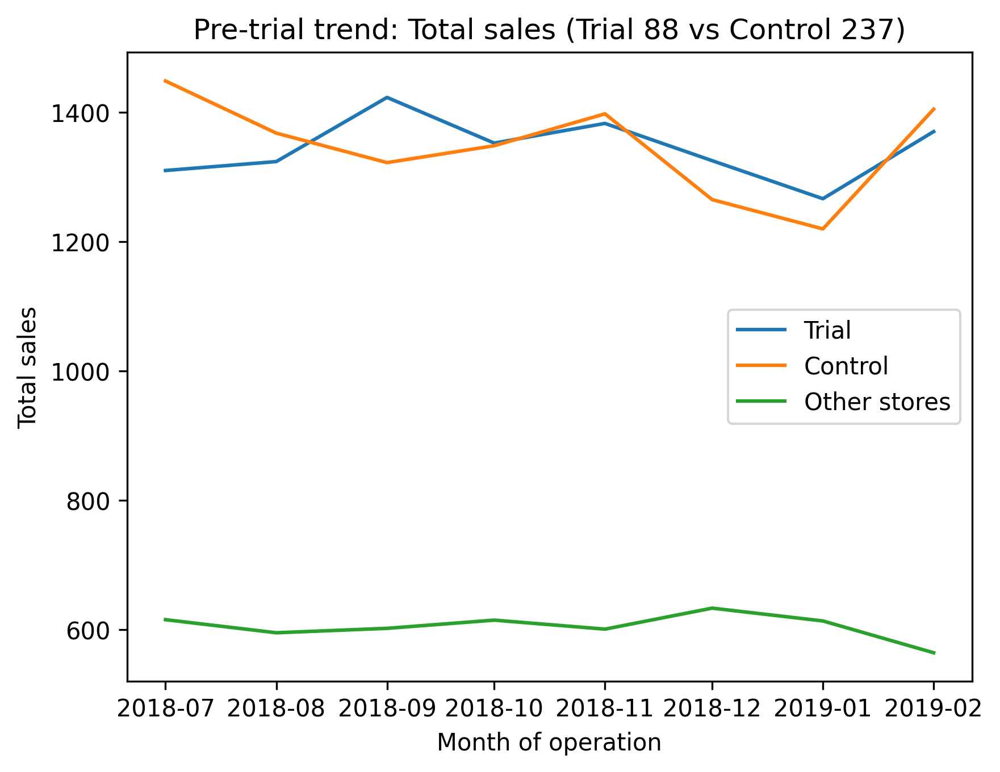
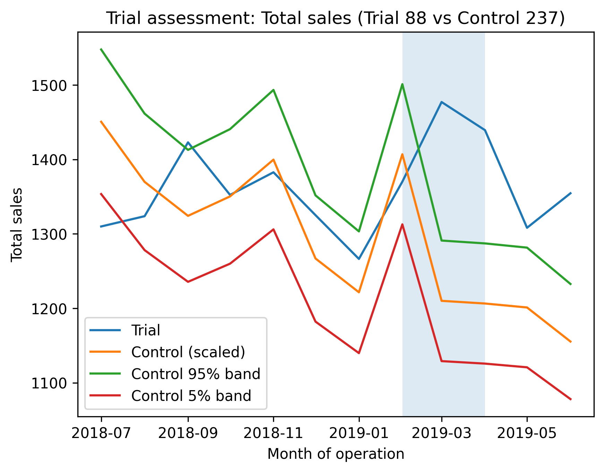

# Quantium Retail Analytics Case Study
### Customer Segmentation, Uplift Testing, and Commercial Recommendations

## TLDR

**Business Goal**  
Identify which customer segments drive chip sales and determine whether new store layouts created enough sales uplift to support a broader rollout.

**Client/Stakeholder**  
Julia, the Chips Category Manager, who needed customer and store-level insights to support the next half-year category strategy.

**What I Built**
- A retail analytics case study analyzing 252K+ transaction records and 72K+ customer records
- R-based cleaning, feature engineering, and customer segment analysis
- Python-based trial vs control uplift testing for 3 store-layout experiments
- A client-facing PowerPoint report using the Pyramid Principle to communicate commercial recommendations clearly

**Key Deliverables**
- Defined business question and stakeholder objective
- Cleaned and validated transaction and customer data
- Engineered product features such as pack size and brand name
- Built customer segment metrics to identify high-value groups and sales drivers
- Performed trial vs control analysis for stores 77, 86, and 88
- Delivered a client-facing report with visualizations, findings, and recommendations

## Links to Deliverables 

- **Final Presentation**  
  Client-facing presentation summarizing customer insights, trial-store performance, and recommendations.
  - [PDF](final_deliverables/task_3_final_presentation_quantium.pdf)

- **Technical Analysis Reports**  
  Detailed reports showing the data preparation, customer analytics, and trial vs control methodology.
  - [Task 1 R Report PDF](final_deliverables/quantium_r_pdf_version1.pdf)
  - [Task 2 Python Report PDF](final_deliverables/Quantium_Task2_Python_Report.pdf)

- **[R and Python Code](r_and_python_code/)**  
  Source code used for customer segmentation, feature engineering, control-store selection, and uplift testing.

- **[PNG Charts](png_charts/)**  
  Visuals used throughout the analysis and final presentation.

- **[Original Data](original_data/)**  
  Source files used for the project.

**Findings**
- Older Families (Budget), Young Singles/Couples (Mainstream), and Retirees (Mainstream) were the strongest sales-driving customer segments
- Family segments purchased more units per customer, supporting larger-pack and multi-buy strategies
- Customer behavior differences were driven more by purchase volume than by price per unit
- Trial vs control analysis showed positive sales uplift across all three trial stores
- The results supported targeted promotions for key segments and consideration of a broader layout rollout with continued monitoring

**Tools Used**

- R
- Python
- PowerPoint

**Why It Matters**

This project shows end-to-end retail analytics, from cleaning raw transaction data to generating business recommendations. It combines customer analytics, experimentation, and stakeholder communication in a way that mirrors how commercial decisions are made in real retail environments.

---

## Overview

This project was completed through Quantium’s Data Analytics Virtual Program on Forage and simulates work for a retail analytics team supporting a supermarket chips category review.

The client, Julia, is the Category Manager for chips and wants to understand which customer segments are driving sales, what purchasing behaviors matter most, and whether a new trial store layout improved performance enough to justify broader rollout.

To answer those questions, I completed the project in three parts:

1. **Data preparation and customer analytics** using R  
2. **Experimentation and uplift testing** using Python  
3. **Client-facing reporting and recommendations** using PowerPoint  

The result is a full case study that moves from raw data to commercial recommendation.

---

## Core Business Question

**Which customer segments should the chips category team prioritize, and did the new trial store layouts improve sales enough to justify wider rollout?**

Subsequent Analytical Questions to Answer:
- Which customer groups drive the most value?
- What behaviors explain category sales?
- Did the new layouts improve store performance?
- What actions should be taken in the next half year?

---

## Client Context

**Primary Stakeholder**  
Julia, Chips Category Manager.

**Business Objective**  
Support the next half-year category strategy by identifying high-value customer segments, understanding purchasing behavior, and evaluating whether a new store layout should be rolled out more broadly.

---

## Project Task Structure

### Task 1: Data Preparation and Customer Analytics

The first task focused on cleaning transaction and customer data, identifying inconsistencies, and building metrics to understand purchasing behavior.

Main work completed:

- Checked data quality issues such as incorrect formats, missing values, and outliers
- Removed non-chip products from the analysis
- Filtered extreme quantity outliers
- Merged transaction and customer data
- Engineered new variables such as pack size and brand name
- Built customer segment metrics including total sales, customer count, units per customer, and average price per unit
- Created charts to identify the strongest customer segments and key category drivers

### Task 2: Experimentation and Uplift Testing

The second task focused on evaluating whether trial store layouts improved performance compared with matched control stores.

Main work completed:

- Aggregated monthly store-level performance measures
- Selected benchmark control stores using pre-trial similarity
- Compared trial stores 77, 86, and 88 against matched controls
- Used correlation and magnitude distance logic to improve control-store matching
- Assessed whether the new layout led to positive sales uplift during the trial period
- Summarized findings and recommendations for each store

### Task 3: Analytics and Commercial Application

The final task focused on translating the technical analysis into a clear stakeholder report.

Main work completed:

- Structured the presentation using the Pyramid Principle
- Summarized key customer segment findings
- Presented trial-store results and recommendations
- Delivered a business-friendly PDF report for a non-technical audience
- Wrote a cover email summarizing the strategic recommendation to the client

---

## Stakeholder Background

As part of Quantium’s retail analytics team, I was asked to support Julia, the Chips Category Manager, with analysis that could inform the supermarket’s strategic plan for the next half year.

The project required moving beyond simple reporting. The analysis needed to explain who was buying chips, what drove sales within the category, and whether a new store layout had enough positive impact to justify a larger rollout.

This made the work a combination of customer analytics, experimentation, and commercial storytelling.

---

## Data Sources

- Transaction data containing a year of chip purchases
- Customer data containing life stage and premium customer segments
- Store-level monthly sales and customer activity used for trial vs control analysis
- Quantium case materials and reporting guidance from the Forage simulation

---

## Data Cleaning and Preparation

A major part of this project involved making the data analysis-ready before drawing conclusions.

Key cleaning and preparation steps included:

- Correcting date formats
- Checking for missing values and inconsistencies
- Removing non-chip products from the category analysis
- Filtering extreme quantity outliers
- Merging transaction and customer datasets
- Deriving useful product-level features such as pack size and brand name

These steps were important because the quality of the segment analysis and the trial-store comparisons depended on having accurate, category-specific data.

---

## Analysis Approach

### Customer Analytics in R

I used R to analyze customer purchasing behavior across life stage and premium customer segments.

Key metrics included:

- Total sales
- Number of customers
- Units per customer
- Transactions per customer
- Average price per unit

This helped identify whether strong performance came from more shoppers, more volume per shopper, or higher pricing.

### Trial vs Control Testing in Python

I used Python to evaluate whether the new layouts improved store performance during the trial period.

The process included:

- Building monthly store-level metrics
- Filtering to stores with full monthly history
- Ranking candidate control stores based on similarity
- Comparing pre-trial trends between trial and control stores
- Measuring trial-period uplift during February 2019 to April 2019

This created a more reliable benchmark for deciding whether the trial layout performed well enough to expand.

---

## Customer Segment Visualizations

### Total Chip Sales by Customer Segment

This chart highlights which customer segments contribute the most total chip sales and helped identify the highest-value groups for category targeting.

---

### Number of Customers by Segment

This view shows whether top-performing segments were driven by broad reach or by a smaller number of high-value customers.

---

### Average Units per Customer by Segment

This chart helped show that family-based segments tended to buy more units per customer, supporting larger-pack and multi-buy strategies.

---

### Average Price per Unit by Segment

This view provided pricing context and helped compare whether differences across segments were driven more by price or by purchase volume.

---

## Trial Store Visualizations

### Pre-Trial Comparison: Store 77 vs Control 233

This chart was used to validate that the control store followed a similar sales pattern before the trial period.

---

### Trial Assessment: Store 77 vs Control 233

This chart compares trial-period performance to determine whether the layout likely improved store sales.

---

### Pre-Trial Comparison: Store 86 vs Control 155

This chart shows the pre-trial relationship between Store 86 and its matched control store.

---

### Trial Assessment: Store 86 vs Control 155

This chart evaluates whether Store 86 experienced positive sales uplift during the layout trial.

---

### Pre-Trial Comparison: Store 88 vs Control 237

This chart validates pre-trial similarity for Store 88 and its matched control.

---

### Trial Assessment: Store 88 vs Control 237

This chart compares Store 88’s trial performance against the scaled control baseline.

---

## How to Run or Reproduce This Project

There are three ways to use this repository.

### Option A: Review the Final Deliverables

Open the final PDFs to review the completed analysis and stakeholder-ready outputs.

1. [Task 1 R Report PDF](final_deliverables/quantium_r_pdf_version1.pdf)  
2. [Task 2 Python Report PDF](final_deliverables/Quantium_Task2_Python_Report.pdf)  
3. [Task 3 Final Presentation PDF](final_deliverables/task_3_final_presentation_quantium.pdf)  

### Option B: Review the Source Code

Open the source code used for the project.

- [Task 1 R Code](r_and_python_code/Task1.Rmd)
- [Task 2 Python Code](r_and_python_code/python_code_trial_vs_control.py)

### Option C: Review the Charts and Data

- [PNG Charts Folder](png_charts/)
- [Original Data Folder](original_data/)

---

## Deliverables

1. Cleaned and validated retail transaction and customer data  
2. Customer segment analysis with business-focused metrics  
3. Product-level feature engineering for pack size and brand  
4. Trial vs control store comparison for 3 layout experiments  
5. Visualization set for customer and store analysis  
6. Client-facing presentation structured for a non-technical stakeholder  
7. Commercial recommendations for targeting, promotions, and layout rollout  

---

## Key Takeaways

- Older Families (Budget), Young Singles/Couples (Mainstream), and Retirees (Mainstream) were identified as priority customer segments
- Family segments tended to buy more units per customer, supporting volume-based promotional strategies
- The strongest opportunities came from targeted promotions, larger-pack offers, and multi-buy deals
- All three trial stores showed positive sales uplift versus matched control stores
- The layout results supported consideration of a broader rollout while continuing to monitor store performance

---

## Why This Project Matters

Retail analytics is not just about summarizing sales data. It is about turning customer behavior and store performance into decisions that affect promotions, category strategy, and merchandising.

This project matters because it combines:

- Data cleaning
- Customer segmentation
- Experimentation
- Visualization
- Stakeholder communication

That makes it a strong example of end-to-end analytics with real commercial relevance.

---

## What I Learned

This project strengthened my ability to:

- Clean and validate retail transaction data before analysis  
- Engineer useful variables from raw product data  
- Compare customer segments using business-relevant metrics  
- Evaluate trial-store performance with matched control logic  
- Translate technical analysis into clear recommendations for non-technical stakeholders  
- Communicate insights through charts, reports, and executive-style presentations  
